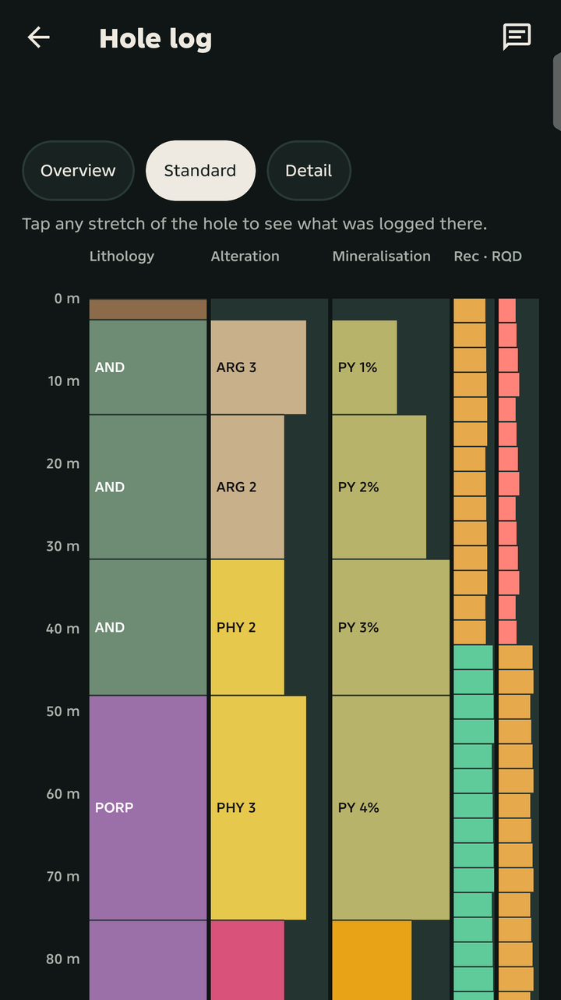
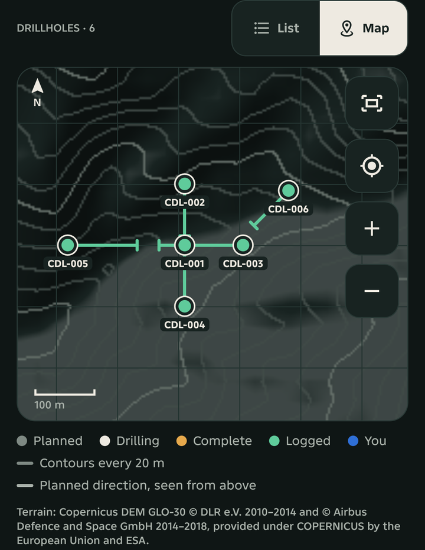
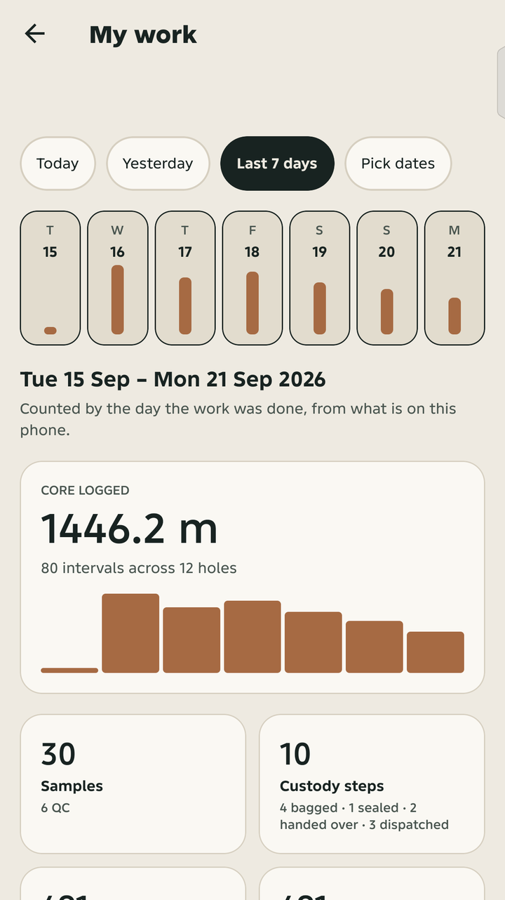

# CoreChain

Drill core passes through a lot of hands before it turns into an assay result. The driller boxes it, a geologist logs it, someone cuts and bags the samples, and weeks later a laboratory sends back numbers. Along the way the record usually ends up split between a field notebook, a few spreadsheets, a chat thread and the lab's own files. When a result looks wrong, tracing it back to the hole, the box, the depth and the person who handled it takes far longer than it should.

CoreChain is our attempt to keep that whole chain in one place, built with exploration and mining teams in the Philippines in mind.

Most of the work happens at the rig and in the core shed, often with no signal, so the main piece is CoreChain Field, an Android app. It lets a geologist log drillholes, core runs, intervals, photos, samples and custody on the phone, fully offline, and it syncs once a connection comes back. The website covers the desk side of the same work, for project managers, QA/QC and the laboratory.

CoreChain Field is in development testing and not yet released. If you log core or work with drilling data and would like to try it, you can request tester access at [corechain-orpin.vercel.app](https://corechain-orpin.vercel.app).

<p>
  
  
  
</p>

<sub>Screens from the phone, showing made-up demo data.</sub>

## What it does today

These have been run on an Android test phone, not only in code:

- Log a drillhole with its collar, core boxes and runs (recovery and RQD), and geological intervals from a code library.
- Build a graphic log of the hole as intervals are saved, and merge touching intervals of the same rock into units.
- Create samples from an interval, including standards, blanks and duplicates. Each sample number is a physical tag and is never reused.
- Take photos tied to the hole and box, which back up to the server when there is a connection.
- Record custody steps for each sample and build a dispatch to the laboratory, shared as a PDF sheet or a CSV.
- Save everything on the phone first, so work carries on without signal (tried in airplane mode), and sync when a connection comes back, including work a teammate recorded on another phone.
- Show the geologist what they did by day or week ("My work") and the holes on a collar map with planned traces and terrain.
- Export the project as CSV files.

The website covers the desk side: a project manager's view of the team's holes and progress, the laboratory's upload of assay results, and QA/QC review of standards, blanks and duplicates.

## Why it's built this way

- **The phone keeps its own database.** The rig and the core shed often have no signal for days, so every screen reads and writes an encrypted SQLite database on the phone, and PowerSync sends changes to Postgres when it can. Nothing waits on the network.
- **One set of rules for both apps.** Depth checks, recovery, sample numbering and custody live in `packages/domain`, so the phone and the website cannot disagree about whether an interval overlaps or a sample is complete.
- **Sample numbers are handed out in blocks.** Two geologists working offline must never print the same tag. The server gives each phone its own block of numbers ahead of time.
- **Custody is append-only.** A mistake is corrected with a new step, never edited or deleted, so the history of a sample can be trusted.
- **Drillhole status is worked out, not picked.** An early version let the geologist set the status by hand, and it went stale. It is now derived from what has been recorded (boxes, dates, logged depth).

## Not finished yet

- Scanning bag tags with the camera, and a warning when a run goes past the hole's final depth, are built but not yet tried on the phone.
- The collar map has terrain but no roads, rivers or imagery.
- Android only. There is no iPhone version and no Google Play listing yet.
- The CSV export has not been tried in Leapfrog or GEOVIA.
- The graphic log and "My work" are waiting for a geologist's review.

## What we would do differently

- **Test sync on a real phone from the first day.** The worst bugs slipped past the automated tests and only showed up on the phone: photos from team accounts that never backed up, and columns silently lost after an account switch.
- **Derive status from the start.** Anything a person has to remember to update will go stale in the field.

## Inside this repository

The phone app lives in `apps/mobile` (Expo and React Native), and the website and its server in `apps/web` (Next.js). The rules both of them share, such as depth checks, recovery, sample numbering and custody, sit in `packages/domain`, so the phone and the website apply them the same way. Product and design notes, the sprint plan and screen mockups are in `docs/product`.

To run it locally:

```bash
npm install
npm run dev          # the website, at http://localhost:3000
npm run dev:mobile   # the phone app; it needs a development build, Expo Go won't work
npm test
```

The website reads its settings from `apps/web/.env`. Start from `apps/web/.env.example`, and keep the real file out of git.

## About the data you'll see

Nothing in the demos or screenshots comes from a real client. The Cordillera porphyry project in `apps/web/data/demo/synthetic-cordillera-porphyry` is made up from start to finish. The Alberta drillholes in `apps/web/data/demo/alberta-dig-2024-0022` are public data from the Alberta Energy Regulator and Alberta Geological Survey, used under the Open Government Licence – Alberta; that folder's README has the full credit.

## Security and licence

If you find a security problem, please report it privately rather than in a public issue. [SECURITY.md](SECURITY.md) explains how.

The code is public so it can be read and reviewed, but all rights are reserved. See [LICENSE](LICENSE).
