# CoreChain: early workflow concept for feedback

## What CoreChain is trying to improve

CoreChain is an early concept for keeping the connection between drill core, geological observations, samples, laboratory results, and QA/QC review clear and traceable.

It is **not** intended to replace a geologist’s judgement, a site sampling procedure, a laboratory system, or geological modelling software such as GEOVIA.

## The workflow being explored

```mermaid
flowchart LR
    A[Drillhole and core received] --> B[Core boxes and depth ranges recorded]
    B --> C[Geologist logs intervals<br/>geology, recovery/RQD, photos]
    C --> D[Sample interval chosen]
    D --> E[Sample ID and label created]
    E --> F[Cutting, bagging, custody, dispatch]
    F --> G[Laboratory results imported]
    G --> H[QA/QC review and approval]
    H --> I[Approved export for reporting or modelling]
```

## The practical problem

In many projects, parts of this process may live in separate places: paper forms, core-box markings, spreadsheets, phone photos, sample registers, email or messaging apps, dispatch records, and laboratory files.

When one record does not match another, the team may need to spend time finding the right sample, depth, photo, or assay result before it can be trusted and used.

## The first CoreChain idea

For every selected sample, CoreChain would preserve a simple chain:

`drillhole → interval → core box → geological log → photo → sample ID → custody / dispatch → assay batch → QA/QC status`

Example:

> Assay result for `CC-000184` came from drillhole `DDH-01`, interval 42.0–43.5 m, recorded in core box 8, with its geology log, photo, dispatch record, laboratory batch, and QA/QC review linked together.

## What it would do first

- Set up project users, geological code lists, and sampling rules.
- Record core boxes, drillhole intervals, geological logging, recovery/RQD, and photos.
- Create and track sample IDs, custody events, and dispatches.
- Import laboratory results through CSV or Excel.
- Show standards, blanks, duplicates, and basic QA/QC alerts.
- Export approved data in a structured format for the customer’s existing tools.

## What it would not try to do yet

- Replace GEOVIA or perform advanced 3D modelling.
- Connect directly to laboratories before a file-import workflow is proven.
- Add blockchain or an immutable ledger before confirming that a normal audit trail is insufficient.
- Force a standard workflow where the project’s established procedure is different.

## Feedback requested

1. Is this close to the real workflow you have seen?
2. Where does it usually fail or take the most time?
3. Which information absolutely must remain accurate and traceable?
4. What would make a geologist or field team reject this?
5. If this solved one issue first, which issue would matter most?
