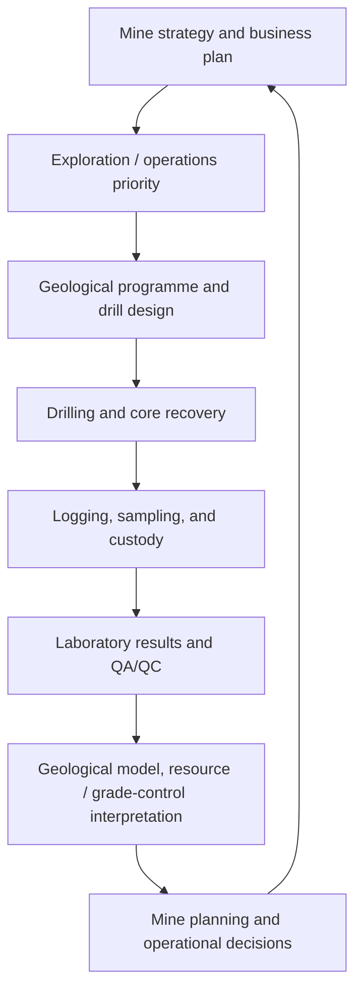

# CoreChain: mining operations context and roles

## The core idea

A mine needs dependable geological and operational information to decide where, how, and when to invest effort and capital. Better information does not guarantee success, but reliable, representative, timely, and traceable information gives mine planning and operational teams a better basis for decisions.

“Intel” is a useful working word. In CoreChain documentation, we will call it **geological and operational data**.

That data is more than commodity grade. It can include lithology, alteration, structure, sample location and depth, core recovery, RQD, density, geotechnical information, assay method, QA/QC controls, and the history of how a sample and result were handled.

## The business-to-field chain



Metal prices, mining method, recovery, costs, permits, available equipment, and the longer-term life-of-mine plan all affect whether material can be mined economically. Geological data informs those decisions; CoreChain does not make them on its own.

## One property can have several geological workstreams

Different workstreams can run at the same time, even within one mine or tenement. The priority and the detail of drilling change by purpose.

| Workstream | Main question | Typical data need |
| --- | --- | --- |
| Early exploration | Is there a viable target here? | Broad geological understanding and initial sampling |
| Resource definition / infill | How continuous and confident is the mineralisation? | Tighter drill spacing and reliable sample data |
| Near-mine exploration / expansion | Can the operation extend or improve its plan? | Targeted drilling close to current or planned workings |
| Grade control / production support | What material is being mined now, and where should it go? | High-resolution, timely information tied to operations |

CoreChain should initially focus on the shared operational chain beneath these workstreams: drillhole, interval, core, sample, custody, laboratory result, and QA/QC decision.

## Who does what

Titles differ between companies. This is a practical responsibility map, not a universal reporting line.

| Role or function | Main responsibility | Relationship to CoreChain |
| --- | --- | --- |
| Mine general manager, resident manager, or exploration/operations leader | Sets business priorities, budget, safety expectations, and the decision the programme must support | Needs a high-level status and exception view |
| Chief geologist or exploration manager | Turns the priority into a geological programme; owns technical direction and review | Defines codes, rules, review gates, and programme visibility |
| Resource geologist, mine planner, geotechnical specialist, and other technical leads | Help determine the drilling question, spacing, orientation, and constraints | Use clean, reliable information after QA/QC |
| Project geologist or field geologist | Coordinates execution, validates field work, manages logging/sampling decisions, and resolves issues | A primary CoreChain user and reviewer |
| Logging geologist and core-yard technician | Receive core, orient/mark where applicable, photograph, log, measure recovery/RQD, select and prepare samples | Frequent CoreChain users |
| Drilling contractor, drill supervisor, and drill crew | Execute the drilling programme safely; record operational drilling information | May provide or confirm collar, run, and recovery information |
| Survey team or specialist contractor | Establishes collar location and measures actual downhole path where required | Supplies planned-versus-actual drillhole data |
| Laboratory coordinator / data manager | Coordinates dispatches, imports results, reconciles exceptions, and tracks completeness | Uses custody, dispatch, import, and QA/QC tools |
| Laboratory | Prepares and assays samples under the agreed method | Returns assay files and associated batch data |

## Important corrections to the first mental model

### The “head of geology” does not work alone

The chief geologist or exploration manager commonly owns technical direction, but drill placement, angle, depth, spacing, and priorities are usually designed and reviewed with other relevant specialists. The exact mix depends on whether the work is exploration, resource definition, geotechnical, or grade control.

### Planned drillhole design and actual drillhole path are different records

The team plans collar, azimuth, dip, target depth, and purpose. The drilling team then executes the hole, and actual position/path may be verified through collar survey and downhole survey. CoreChain should preserve both the **planned** and **actual** information rather than assume they are the same.

### QA/QC is not only a senior-person sign-off

QA/QC begins in the field and continues through sampling, custody, laboratory preparation, assays, imports, and review. Standards, blanks, duplicates, recovery, contamination risk, and reconciliation checks help determine whether the result is fit for its intended use. The qualified geologist makes the technical decision; the app makes the evidence and exceptions visible.

### More data is not automatically better

The useful goal is enough data of the right quality, spacing, representativeness, and timing for the decision at hand. A large pile of untraceable or inconsistent records can reduce confidence instead of increasing it.

## Where CoreChain enters

CoreChain sits below the technical interpretation and business decision layers. It protects the working evidence used by those layers.

```text
Programme approved
  → Drillhole planned
  → Core arrives
  → Core logged and photographed
  → Samples created and handed over
  → Dispatch confirmed
  → Assays imported
  → QA/QC reviewed
  → Clean data exported to modelling, planning, or reporting tools
```

The first user value is simple: the project geologist or core-yard team should not have to reconstruct a sample’s history from notebooks, spreadsheets, messages, and separate laboratory files.

## Later visual outputs

Once the underlying data is trustworthy, CoreChain can provide useful operational views without trying to replace GEOVIA or specialist geological modelling tools:

- Drillhole plan map with status and depth.
- Drillhole trace / collar-to-target view, planned versus actual.
- Interval log with recovery, RQD, geology, photos, and sample status.
- Assay grade versus depth charts.
- Dispatch and laboratory turnaround view.
- QA/QC exception dashboard.

Sections, resource modelling, and 3D interpretation remain later integrations or exports to specialist tools.

## Product implication

CoreChain’s first build must capture the chain reliably, not attempt to be the decision-maker. The app should answer:

> “Can the geological team trust, find, and explain the evidence behind this drill interval and sample result?”

If it can answer that well, it strengthens exploration, resource-definition, near-mine, and grade-control workflows without replacing the mine plan or geological model.

## Reference note

International reporting guidance reinforces why the workflow needs traceability: the CRIRSCO reporting template covers drilling, sample collection and storage, laboratory preparation and analysis, sampling governance, and QA/QC; the JORC Code defines minimum standards for public reporting of exploration results, mineral resources, and ore reserves. These sources guide the evidence concepts here; company procedures and Philippine requirements must still be confirmed with pilot users before configuring CoreChain.

- CRIRSCO, *International Reporting Template* (current template/resources): https://crirsco.com/documentation/itr/
- JORC, *Code and Table 1 resources*: https://jorc.org/library/
