# Core workflow primer: drill core to trusted assay result

## Purpose

This note explains the real-world workflow that CoreChain may support. It is an early product-learning reference, not a substitute for a site-specific sampling procedure, laboratory contract, or competent geologist’s judgement.

## Plain-language workflow

1. **Drillhole created** — The exploration team gives the hole a unique identifier, such as `DDH-01`.
2. **Core received** — The drilling contractor places recovered drill core into numbered boxes in depth order, with depth markers.
3. **Core logged** — A geologist records geological observations by depth interval: rock type, alteration, mineralisation, structures, core recovery, RQD, and photographs.
4. **Sample interval selected** — The geologist chooses an interval for laboratory analysis, for example 42.0–43.5 m.
5. **Sample identified and prepared** — The interval receives a unique sample ID. Core may be cut, bagged, and prepared according to the project’s procedure.
6. **Custody and dispatch recorded** — The team records each handoff and the laboratory dispatch.
7. **Laboratory results imported** — Assay results return as a laboratory batch, initially through CSV or Excel import.
8. **QA/QC reviewed** — Standards, blanks, and duplicates help identify accuracy, contamination, and repeatability concerns.
9. **Results approved for use** — Authorised results support exploration decisions and reporting.

```mermaid
flowchart LR
    A[Drillhole created<br/>e.g. DDH-01] --> B[Core received<br/>boxes and depth ranges]
    B --> C[Geologist logs core<br/>rock, recovery, RQD, photos]
    C --> D[Sample interval selected<br/>e.g. 42.0–43.5 m]
    D --> E[Sample ID assigned<br/>CC-000184]
    E --> F[Cut, bag, and dispatch<br/>custody recorded]
    F --> G[Laboratory assay batch]
    G --> H[QA/QC review<br/>standards, blanks, duplicates]
    H --> I[Approved results<br/>reporting and decisions]
```

## Why this workflow matters

The records are commonly distributed among core-box markings, paper forms, Excel logs, mobile-phone photos, emails or messaging apps, sample registers, dispatch documents, and laboratory spreadsheets. A depth or sample-ID mismatch breaks confidence in the final assay result and creates time-consuming reconciliation work.

## CoreChain product implication

The candidate first feature is a **Core-to-Sample Chain**. It must preserve the links between:

`drillhole → depth interval → core box → geological log → photo → sample ID → custody event → dispatch → assay batch → QA/QC decision`

The intended question it answers is:

> This assay result came from which sample, which exact drillhole interval, which original core record, and which custody and review history?

### Candidate MVP flow

1. Create or select a drillhole.
2. Register core boxes and depth ranges.
3. Log geology, recovery/RQD, and photos by interval.
4. Select a sample interval and assign a sample ID.
5. Record sample status and custody handoffs.
6. Import assay results and flag basic QA/QC issues.

This is a candidate to validate with users. It is not yet a committed product scope.

## Sources for the final PDF

- Roger Marjoribanks, *Geological Methods in Mineral Exploration and Mining*, 2nd edition (Springer, 2010). The published overview identifies it as a practical guide covering exploration techniques, drilling, core logging, and exploration databases. <https://link.springer.com/book/10.1007/978-3-540-74375-0>
- CSIRO, “Introducing MyLogger: a new tool for interpreting hyperspectral data from drill cores” (13 September 2023). It describes geological logs as foundational to minerals work and notes the traditional manual logging process can be time-consuming and subjective. <https://www.csiro.au/en/news/All/Articles/2023/September/MyLogger>
